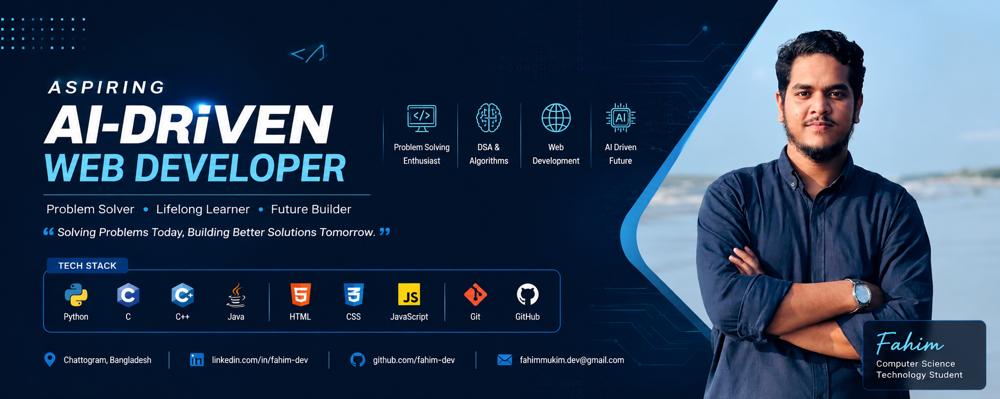

  

<h1 align="center">Hi 👋, I'm Fahim Uddin Mukim</h1>

<h3 align="center">
  AI-Driven Web Engineering | Problem Solving | Aspiring Software Engineer
</h3>

  An aspiring software engineer passionate about AI-driven web engineering and problem solving from Bangladesh.

---

## 👨‍💻 About Me

I'm a Computer Science Technology student currently learning **AI-driven web engineering** and exploring modern software development.

I enjoy programming, problem solving, learning how technologies work, and turning ideas into practical solutions. My long-term goal is to become a skilled **Software Engineer** and build intelligent, scalable software that solves real-world problems.

### 🚀 Currently

- 🌱 Learning AI-driven Web Engineering
- 💻 Exploring modern Web Development technologies
- 🧠 Practicing Data Structures & Algorithms
- 🤖 Exploring AI integration in Web Applications
- 🔨 Building projects to improve my real-world development skills

---

## 🛠️ Skills & Technologies

  

## 🚀 Currently Exploring

- ⚡ Modern JavaScript & TypeScript
- 🌐 Web Engineering
- 🤖 AI Integration in Web Applications
- 🧩 Data Structures & Algorithms
- 🔧 Building Real-World Projects

## 📊 GitHub Stats

  
  

  

---

## 🌐 Connect With Me

---

## 🎯 My Goal

To become a skilled **Software Engineer** by continuously improving my programming, problem-solving, and software development skills while exploring the possibilities of **AI + Web Engineering**.

---

  ⭐ Feel free to explore my repositories and follow my journey!

  

